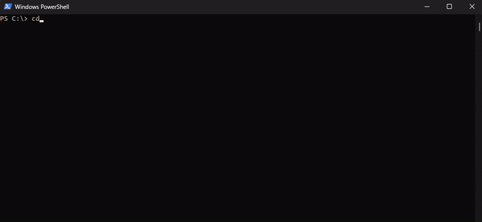
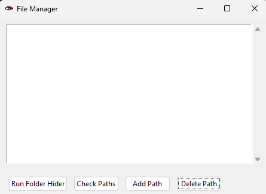

This program hides folder and/or files in windows
***
### set up
1. Download zip
2. Unzip file and you should have a folder called ```File_Mananger-master```
3. Open CMD or Powershell and ```cd``` to that folder
4. Run main.py file





***